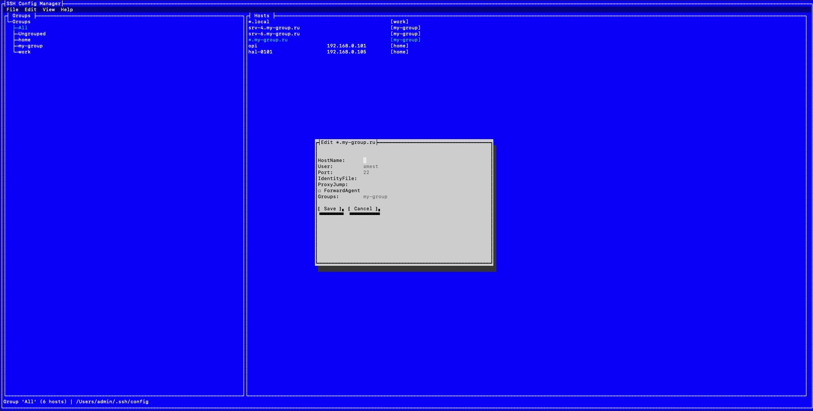

# ssh-config-tui

A terminal UI for managing your SSH config. Organize hosts into groups, edit parameters, and keep your `~/.ssh/config` clean — all from the comfort of your terminal.

## Screenshot

[](docs/screenshot.png)

## Features

- Browse and edit all your SSH hosts
- Group hosts (production, staging, personal) — groups stored as `# tui-group:` comments inside the config file, fully compatible with standard `ssh`
- Edit global `Host *` settings
- Test SSH connection with `ssh -G`
- Copy connection string to clipboard
- Import/export host blocks
- Templates for quick host creation
- Backup on save (`~/.ssh/config.backup`)

## Installation

### dotnet tool (cross-platform)

```bash
dotnet tool install -g ssh-config-tui
ssh-config-tui
```

### Self-contained binaries (no .NET required)

Download the archive for your OS and architecture from [Releases](https://github.com/AMEST/ssh-config-tui/releases), extract and run.

**macOS:**

```bash
xattr -d com.apple.quarantine ./ssh-config-tui
chmod +x ./ssh-config-tui
./ssh-config-tui
```

**Linux:**

```bash
chmod +x ./ssh-config-tui
./ssh-config-tui
```

## Usage

Launch the app: `ssh-config-tui`

### Keyboard shortcuts

| Key     | Action           |
|---------|------------------|
| Ctrl+S  | Save config      |
| Ctrl+Q  | Quit             |
| Ctrl+N  | Add host         |
| Ctrl+T  | Test connection  |
| F5      | Refresh          |
| Enter   | Edit host        |
| Del     | Delete host      |

### Groups

Groups are stored as `# tui-group:` comments inside `~/.ssh/config`:
- Built-in groups: **All** (every host), **Ungrouped** (hosts without any group)
- Custom groups are created by adding the comment to a host
- Select a group in the left panel to filter hosts

## Building from source

Prerequisites: .NET 9.0 SDK

```bash
git clone https://github.com/AMEST/ssh-config-tui.git
cd ssh-config-tui
dotnet build src
dotnet run --project src
```

To create a self-contained binary:

```bash
dotnet publish src/ssh-config-tui.csproj -c Release -r <rid> --self-contained true -p:PublishSingleFile=true
```

## License

MIT
